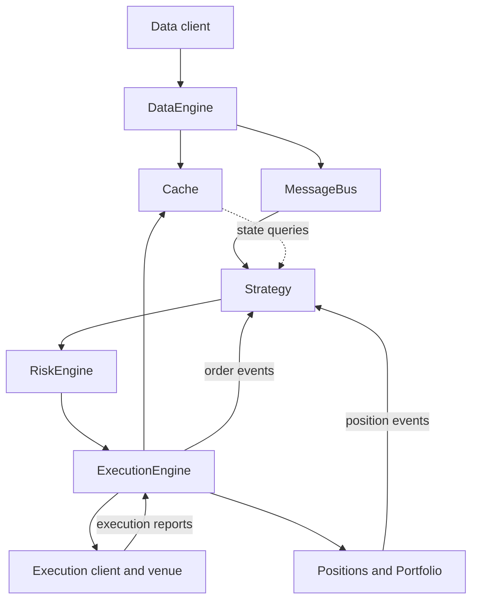

# The NautilusTrader system map

[Course home](../README.md) · [All lessons](../COURSE.md) · [Section index](README.md) · [← Previous](02-mental-models.md) · [Next →](04-how-to-study.md)

Think of NautilusTrader as an event-processing system. Your strategy consumes observations, reads state, and requests actions. Other components perform checks, route commands, and process execution reports.

This is a conceptual dependency map, not a complete call graph or a promise about the ordering of every callback. In a backtest the venue is simulated; live execution uses an adapter. `Trader` manages user components, while the kernel assembles the shared runtime. Actors and execution algorithms are additional extension points.

The practical question is always: **which component owns the state I am trying to change?** A strategy requests an order; it must not invent a fill or overwrite inventory to make its own prediction true.

## Official reference

- [Architecture](https://nautilustrader.io/docs/latest/concepts/architecture/)

---

[Course home](../README.md) · [All lessons](../COURSE.md) · [Section index](README.md) · [← Previous](02-mental-models.md) · [Next →](04-how-to-study.md)
